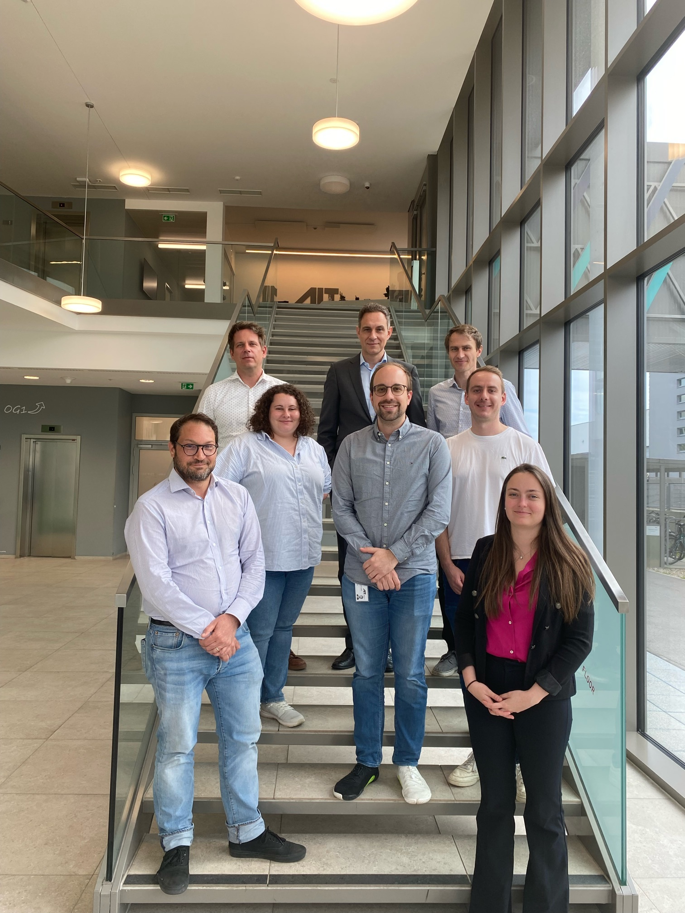

Die Kernfrage des Projekts _TeKaVe - Technologieneutrale Kapazitätsmechanismen für eine Versorgungssichere Energiezukunft_
betrifft, ob das Marktsystem in Österreich in seiner derzeitigen Form (Energy-Only-Markt) im Stande ist, zur gleichen Zeit ein versorgungssicheres Energiesystem aufrecht zu erhalten und die Dekarbonisierungsziele Österreichs zu erreichen.

<!--more-->

In den vergangenen Jahren war der Strommarkt starken Schwankungen und Markteingriffen unterworfen, die mitunter starke Auswirkungen für die Versorgungssicherheit haben können. Zusätzlich haben hohe Anteile aus erneuerbaren Energieträgern (EE) ausgelöst von den Fördermechanismen zu stark schwankender Erzeugung und steigendem Bedarf an Flexibilität sowie zusätzlichen Erzeugungstechnologien und Speicherkapazitäten geführt. Zusätzlich hat die Ukrainekrise seit Mitte 2021 einen bisher nie dagewesenen Preisanstieg ausgelöst. Jedoch schaffen zusätzliche Preisvolatilität, ungewisse geopolitische Situation und kurzfristige Markteingriffe langfristig keine Planungssicherheit und daher nicht ausreichend Investitionsanreize. Die Vermutung liegt nahe, dass neben weiterem EE-Ausbau, um die ambitionierten Dekarbonisierungsziele zu erreichen, der Energy-Only-Markt nicht ausreichend Anreize in Zukunft geben wird, um neue Investitionen zu tätigen.

In vielen Europäischen Ländern sind bereits heute eine Reihe verschiedener Kapazitätsmechanismen (KM), wie bspw. zentrale oder dezentrale Kapazitätsmärkte bzw. strategische Reserven, in Kraft. Zudem wurden andere innovative Optionen vorgeschlagen (zB. Capacity Subscriptions). Zukunftsgemäße Maßnahmen erfordern die Teilnahme aller Anbieter, steuerbare Erzeugung, Speicher, Demand Response und EE. Bei Ausgestaltung der Kapazitätsmechanismen jeglicher Art müssen sie miteinbezogen werden. Aufgrund von langen Vorlaufzeiten besteht Handlungsbedarf bereits heute.

## Factsheet

|   |   |
|---|---|
| **Kurzform** | <mark>TeKaVe</mark> |
| **Titel** | Technologieneutrale Kapazitätsmechanismen für eine Versorgungssichere Energiezukunft |
| **Laufzeit** | 01.03.2024 -- 31.08.2025 |
| **Partner** | 3 |
| **Projektform** | Kofinanziertes Forschungsprojekt |
| **Projektleitung** | [Stefan Strömer](mailto:stefan.stroemer@ait.ac.at) |

## Haupterkenntnisse

Die qualitative und quantitative Analyse des derzeitigen Energy-Only-Markts in Österreich zeigt, dass ausreichend Deckungsbeiträge für ausgewählte Marktteilnehmer:innen in der aktuellen Markt- und Systemlage nur schwer realisierbar sind und der Energy-Only-Markt derzeit nicht alle Voraussetzungen für ausreichende Investitionsanreize in neue Kapazitäten erfüllt. Unzureichende Planungssicherheit, ausgelöst durch regulatorische und politische Unsicherheiten, sowie die Ungewissheit hinsichtlich des hinreichenden Auftretens von Knappheitspreisen stellen hierbei die ausschlaggebenden Problemfelder dar. Die Ergebnisse der Marktmodellierung zeigen, dass im österreichischen Kontext ein Kapazitätsmarkt eine ausgewogene und effiziente Lösung darstellt, um Versorgungssicherheit zu gewährleisten und gleichzeitig Marktverzerrungen zu minimieren. Eine Ausschreibung für neue Flexibilität weist zwar die geringsten Kosten für Konsument:innen auf, führt jedoch zu erheblichen marktverzerrenden Auswirkungen. Eine reine strategische Reserve scheitert am beschränkten Volumen der Teilnehmer:innen in Österreich und zeigt zudem negative Auswirkungen auf den Day-Ahead-Markt in Form eines erhöhten Preisniveaus.

Die länderübergreifende Analyse bestehender Kapazitätsmechanismen in Europa zeigt, dass in einem Kapazitätsmarkt Lock-in-Effekte fossiler Kapazitäten unbedingt vermieden werden müssen, um die österreichischen Energie- und Klimaziele zu erreichen. Gleichzeitig ist bei der Ausgestaltung Technologie-Inklusivität von zentraler Bedeutung, um den zukünftigen Flexibilitätsbedarf angemessen abzudecken. Regionale Komponenten sind zwar grundsätzlich möglich, ihre Umsetzung erweist sich jedoch als komplex, sodass das Verhältnis von Aufwand und Nutzen kritisch zu hinterfragen ist. Eine weitgehende Harmonisierung ist erstrebenswert, weshalb sich die Ausgestaltung eines österreichischen Kapazitätsmarkts an den Kriterien des Clean Industrial Deal State Aid Frameworks (CISAF) orientieren sollte. Dies erleichtert eine schnellere Genehmigung durch die Europäische Kommission, fördert die grenzüberschreitende Teilnahme und schafft regulatorische Sicherheit für die kommenden Jahre.

## Überblick

Die Kernfrage des Projekts wird aus der regulatorischen sowie ökonomischen Sicht untersucht. Für die ökonomische Analyse wird ein innovativer Modellierungsansatz angewendet, der Investitionsoptimierung und agentenbasierte Marktmodellierung kombiniert. Somit können die KM-Designs verglichen werden sowie der Einfluss weiterer Faktoren wie EE-Förderung, CO2-Bepreisung oder Flexibilitätsmaßnahmen untersucht werden.

### Projektziele

Die Innovation dieses Projektes besteht darin, dass:

1. die Kapazitätsmechanismen auf Sinnhaftigkeit im österreichischen Kontext unter Berücksichtigung von drei Zielen, Technologieneutralität, Klimaneutralität und Versorgungssicherheit, untersucht werden;
2. aus der regulatorischen Sicht der Anpassungsbedarf, die Alternativlösungen zu den KMs sowie der Harmonisierungsbedarf auf europäischer Ebene beleuchtet wird;
3. ein innovativer Modellierungsansatz für die Abbildung einzelner KMs verwendet wird;
4. die Grundlage für ein F&E Folgeprojekt, dass den modellierten Ansatz in einem Proof-of-Concept testet, geschaffen wird.

Das Projekt TeKaVe leistet damit einen wertvollen Beitrag zur Gestaltung eines versorgungssicheren Stromsystems in Österreich unter Berücksichtigung der EE-Ziele sowie zur Verbesserung der Anreizmodelle für flexible Technologien, Demand Response und erneuerbare Energiequellen.

### Projektpartner

- [AIT Austrian Institute of Technology GmbH](https://www.ait.ac.at/ueber-das-ait/center/center-for-energy) (Projektkoordinator)
- [Energieinstitut an der Johannes Kepler Universität Linz](https://energieinstitut-linz.at/)
- [EPEX SPOT SE](https://www.epexspot.com/)

### Förderhinweis

Dieses Projekt wird im Rahmen der Ausschreibung "Energie.Frei.Raum" des Bundesministeriums für Klimaschutz, Umwelt, Energie, Mobilität, Innovation und Technologie (BMK) durchgeführt. Die Abwicklung erfolgt im Auftrag des BMK durch die Österreichische Forschungsförderungsgesellschaft (FFG).
Mehr Informationen finden sich in der [FFG Projektdatenbank](https://projekte.ffg.at/projekt/4805444).

## Arbeitspakete & Deliverables

Die Projektziele werden mithilfe von vier dedizierten Arbeitspaketen innerhalb des Projekts erreicht, die auf Folgendes abzielen:



<!-- =============================================================================================================== -->

<u>Aufgaben</u> 
<ul>
  <li>Effektives Projektmanagement - insbesondere Koordination und Controlling - mit Fokus auf Erreichung der Projektziele und Projektergebnisse</li>
  <li>Zeitmanagement, Priorisierung und Moderation der Entscheidungsfindung bei inhaltlichen Problemen</li>
  <li>Klärung rechtlicher Fragen und Erstellung des Konsortialvertrages</li>
  <li>Qualitätssicherung</li>
  <li>Kommunikation und Vermarktung der Projektergebnisse sowie Diskussion der Zwischen-/Endergebnisse mit relevanten Stakeholdern</li>
</ul>

<u>Deliverables</u> 

<!-- =============================================================================================================== -->

<u>Aufgaben</u> 
<ul>
  <li>Überprüfung bestehender Ansätze zur Versorgungssicherheit in Europa und der weiteren Einflussfaktoren</li>
  <li>Auswahl eines Satzes von Kapazitätsmechanismen zur Modellierung in Arbeitspaket 3</li>
  <li>Formulierung von Stakeholder- und Politikempfehlungen (<u>Lead: EI-JKU</u>)</li>
</ul>

<u>Deliverables</u> 

<!-- =============================================================================================================== -->

<u>Aufgaben</u> 
<ul>
  <li>Implementierung eines kombinierten Modells zur Abbildung des Energy-Only-Markts (EOM) und ausgewählter KMs</li>
  <li>Vergleich einzelner KM-Designs gegen das Basisszenario (EOM)</li>
  <li>Szenarioanalyse</li>
</ul>

<u>Deliverables</u> 

<!-- =============================================================================================================== -->

<u>Aufgaben</u> 
<ul>
  <li>Entwicklung einer angemessenen Schadenersatzregelung für Kapazitätsmärkte basieren auf mind. 3 bestehenden Berechungsmethoden für Preisobergrenzen</li>
  <li>Analyse von mind. 3 Alternativlösungen zu KMs: Ausstiegsprämien bzw. Überführung in Staatseigentum, Weiterentwicklung vorhandener Märkte (PICASSO, MARI), Stilllegungsverbote und strategische Reserven</li>
  <li>Analyse des Harmonisierungsbedarfs auf europäischer Ebene</li>
</ul>

<u>Deliverables</u> 

<!-- =============================================================================================================== -->



## Einblicke



<!-- =============================================================================================================== -->



<!-- =============================================================================================================== -->

Konsortialmeeting mit dem Projektteam am AIT in Wien

  



<!-- =============================================================================================================== --> 
<!-- =============================================================================================================== -->


<u>Im Workshop behandelte Themen:</u> 
<ul>
  <li>Potenzielle Problemfelder des österreichischen Energy-Only-Markts: Ergebnisse der quantitativen und qualitativen Analyse für Österreich</li>
  <li>Regulatorik: Überblick über Anforderungen an Kapazitätsmechanismen laut europäischem Recht</li>
  <li>Überblick zu Kapazitätsmechanismen, Lessons Learned und Ausgestaltungsoptionen: Empfehlungen für die Ausgestaltung
  von einem österreichischen Kapazitätsmechanismus basierend auf den bisherigen Erfahrungen in anderen europäischen Ländern</li>
  <li>Marktmodellierung: Ergebnisse des implementierten Modells für Österreich zur Abbildung des Energy-Only-Markts (EOM),
  verschiedener Marktmechanismen (Marktprämie, EKB-S) und ausgewählter Kapazitätsmechanismen</li>
  <li>Stimmen aus der Praxis: Erfahrungen und Perspektiven von ausgewählten Stakeholdern (Wien Energie & EPEX SPOT)</li>
</ul>
<u>Präsentation</u>: <a href="assets/TeKaVe_Stakeholder_Workshop_final.pdf" target="_blank">Stakeholder Workshop</a>  
<u>Präsentation</u>: <a href="assets/TeKaVe_Stakeholder_Workshop_WE.pdf" target="_blank">Wien Energie</a>


<!-- =============================================================================================================== -->

